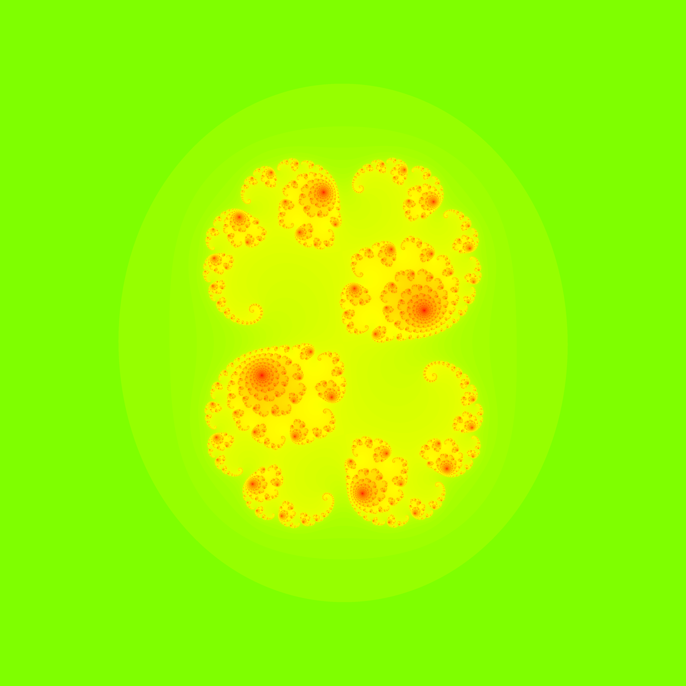
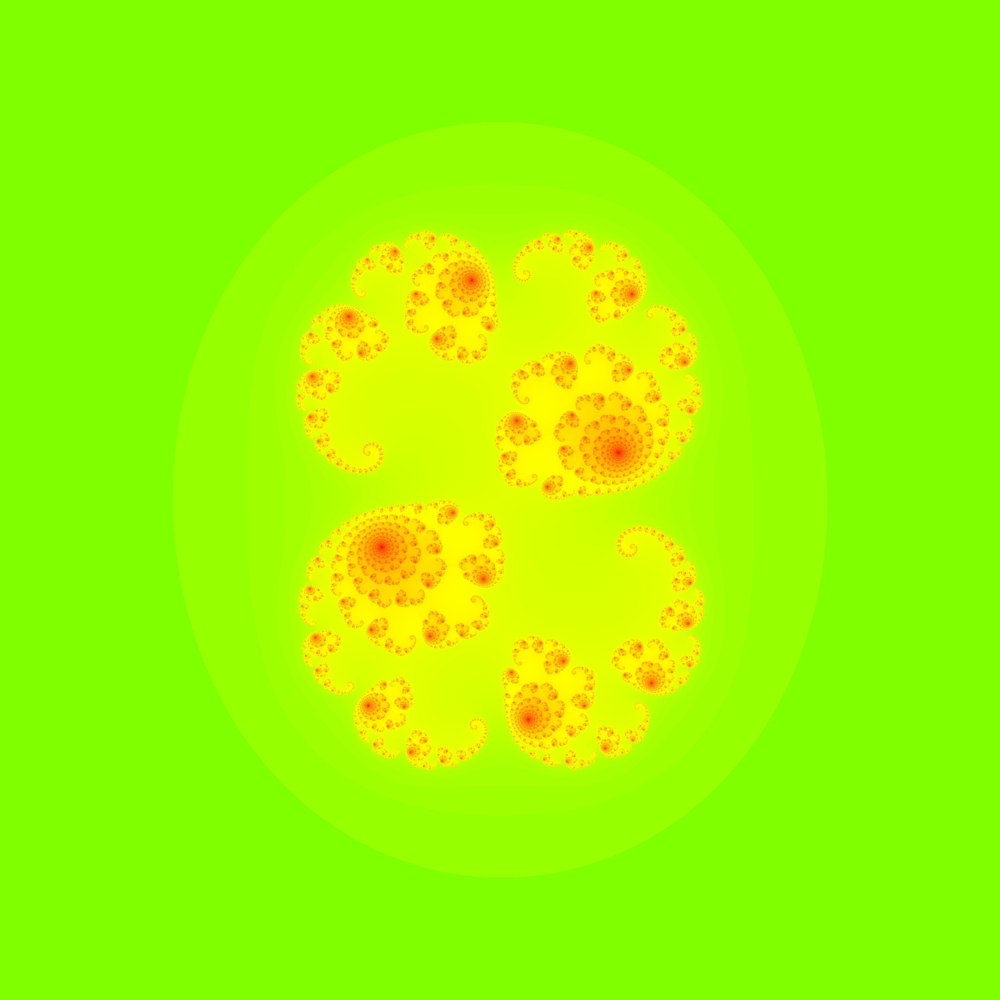
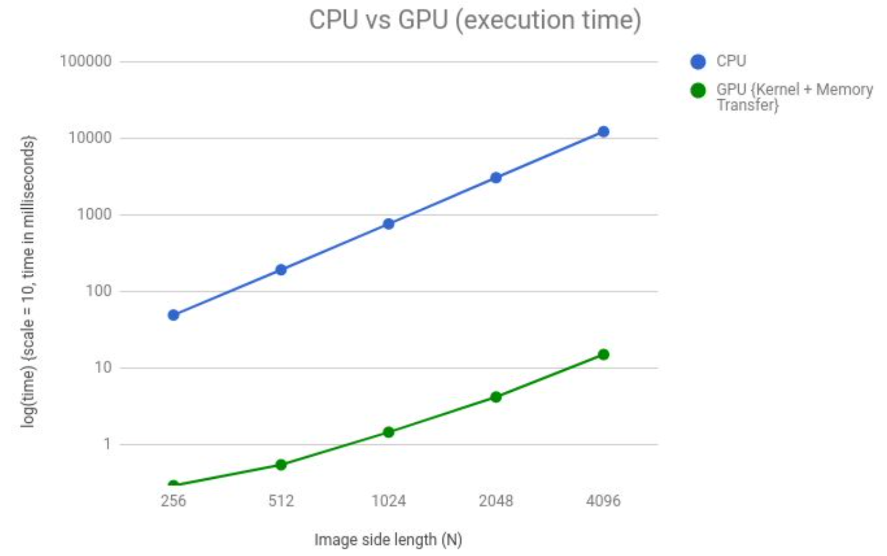

# Julia-set-computation
CUDA implementation for Julia set computation.

In this project we:
* Generate the Julia set on the GPU by dividing the work load in a 2D thread configuration.
* Evaluate the correctness of generated results by comparing the generated images.
* Compare the GPU vs CPU execution time as a function of image size for a given value of c.

## Background
Julia sets are a type of fractals that can be computed in the complex domain. The Julia set is associated with points z = x + iy on the complex plane for which the series

zn+1 = zn2 + c,

does not tend to infinity. Here, c is a complex constant, and one gets a different Julia set for each c. The initial value z0 for the series is each point in the image plane. In order to compute the Julia set, we need to determine if a point escapes to infinity under the given mapping or remains bounded in the image plane.

Here we introduce a color coding that is proportional to the number of iterations taken by a point to escape a circle of radius 2 units (a heuristic for escape to infinity).

## Results
1. Correctness:
	* Images produced by CPU and GPU (for N = 4096)
		CPU Image              |  GPU Image
	  :-------------------------:|:-------------------------:
	    |  

	*  Percentage similarity and the average error in pixel values as a function of N.
      Image side length (N) | Percentage Similarity | Average Error |
        :-------------------------:|:-------------------------:|:-------------------------:
        256 | 99.970505 | 0.003031
        512 | 99.97406 | 0.00266
        1024 | 99.969864 | 0.003068
        2048 | 99.970039 | 0.003168
        4096 | 99.969704 | 0.003297
2. Execution time comparision (with c = 0.285 + i 0.01):

	 
	
	Image side length (N) | CPU (ms) | GPU {Kernel + Memory Transfer} (ms)
	:-------------------------:|:-------------------------:|:-------------------------:
	256 | 49.796 | 0.295808
	512 | 194.068 | 0.55424
	1024 | 769.479 | 1.475488
	2048 | 3083.295 | 4.24192
	4096 | 12297.033 | 15.2028160

## Execution
* Run make and set the library path: `export LD_LIBRARY_PATH=./devil/lib`.
* Execute the object file created, `./parallel_julia`. 
